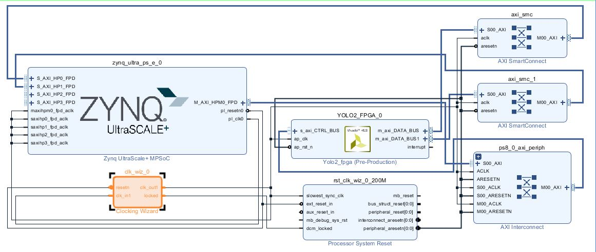
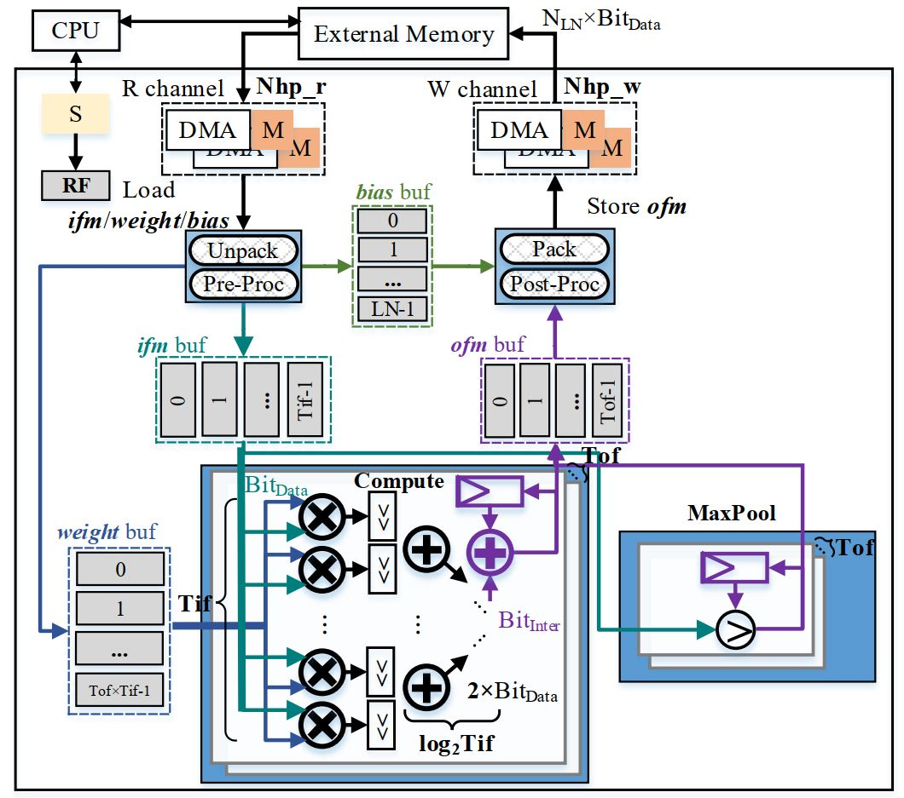
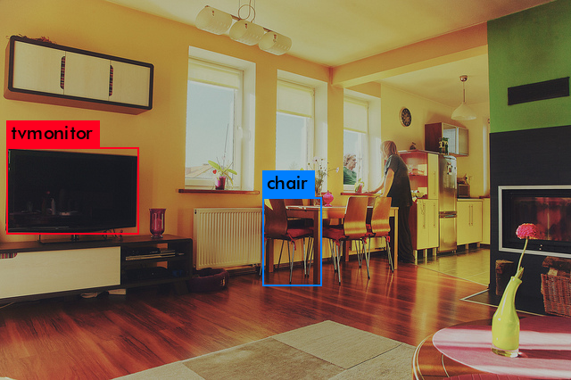

# YOLOv2 Accelerator in Xilinx's Zynq-7000 Soc(PYNQ-z2, Zedboard and ZCU102)
A Demo for accelerating YOLOv2 in Xilinx's FPGA PYNQ-z2, Zedboard, ZU3EG and ZCU102
__I have graduated from Jiangnan University, China in July 1, 2019. Related papers are available now.__  
Master thesis ["Research of Scalability on FPGA-based Neural Network Accelerator"](https://kns.cnki.net/KCMS/detail/detail.aspx?dbcode=CMFD&dbname=CMFDTEMP&filename=1019228234.nh&uid=WEEvREcwSlJHSldRa1FhdXNXaEhoOGhUTzA5T0tESzdFZ2pyR1NJR1ZBaz0=$9A4hF_YAuvQ5obgVAqNKPCYcEjKensW4IQMovwHtwkF4VYPoHbKxJw!!&v=MjE5NTN5dmdXN3JBVkYyNkY3RzZGdFBQcTVFYlBJUjhlWDFMdXhZUzdEaDFUM3FUcldNMUZyQ1VSTE9lWnVkdUY=)  
Journal article ["Design and implementation of FPGA-based deep learning object detection system"](https://kns.cnki.net/KCMS/detail/detail.aspx?dbcode=CJFQ&dbname=CJFDLAST2019&filename=DZJY201908009&uid=WEEvREcwSlJHSldRa1FhdXNXaEhoOGhUTzA5T0tESzdFZ2pyR1NJR1ZBaz0=$9A4hF_YAuvQ5obgVAqNKPCYcEjKensW4IQMovwHtwkF4VYPoHbKxJw!!&v=MDU0NDJDVVJMT2VadWR1Rnl2Z1c3ck1JVGZCZDdHNEg5ak1wNDlGYllSOGVYMUx1eFlTN0RoMVQzcVRyV00xRnI=)   
Journal article ["Design and Implementation of YOLOv2 Accelerator Based on Zynq7000 FPGA Heterogeneous Platform"](https://kns.cnki.net/KCMS/detail/detail.aspx?dbcode=CJFQ&dbname=CJFDTEMP&filename=KXTS201910005&uid=WEEvREcwSlJHSldRa1FhdXNXaEhoOGhUTzA5T0tESzdFZ2pyR1NJR1ZBaz0=$9A4hF_YAuvQ5obgVAqNKPCYcEjKensW4IQMovwHtwkF4VYPoHbKxJw!!&v=MjkwNzdXTTFGckNVUkxPZVp1ZHVGeXZnVzdyT0xqWGZmYkc0SDlqTnI0OUZZWVI4ZVgxTHV4WVM3RGgxVDNxVHI=)

# Q & A 
[1] Why designs stall at Layer 0?
You could first disable the HLS dependency progma in CONV module, and try again in hardware. HLS's dependency progma is very strange, some problems might occur in different HLS version. We suggest Vivado HLS v19.2.

[2] Why output in accelerator is not the same as software version, or even whole white/black?
Turn to Question 1. Besides, you could try to increas Tr/Tc, this might helpful to avoid this problem.

## (1)Software Simulation
Firstly, you should download the darknet source from [https://github.com/pjreddie/darknet](https://github.com/pjreddie/darknet) and yolov2.weights from [https://pjreddie.com/media/files/yolov2.weights](https://pjreddie.com/media/files/yolov2.weights). 

Secondly, modify the darknet's weight load function to get the weights and biases that we want (batcn normalizaton could be combined with weight and bias).

Thirdly, considering that multiple/addition operations in FT32 precision that implemented in hardware logic would consume too much resources in FPGA[3][6], we could use lower percision (e.g., INT16/INT8) instead of FT32 to eliminate hardware overhead. Here, I follow [3][6] to quantize the input/output feature maps, weights and biases from FT32 to INT16/INT8. 

## (2)HLS Accelerator and Simulation
Oh, this part is too complicated to brightly intoduce. __Current design didnt implemment C/RTL co-simulation, because that testbench always overflow!__ if anyone could solve it, please tell me and upload it, Thanks!
## (3)Vivado Block Design
Just connect the YOLOv2 IP in Vivado Block Design. Only the clock wizzard configuraiotn should be careful (Set Reset Type to Active Low). PS's default input clock is 100MHz. In Xilinx's User Guide UG585/1037, 4 High Performance (HP) PS-PL AXI ports are uesd to share DRAM with APU. HP2/3 shares the same axi interconnect, and we suggest connecting concurrent Write-ports to HP0/1/2 or HP/0/1/3 for preventing IO traffic.

## (4)PetaLinux
Related steps have been updated in Petalinux direcotry. Just use two files(__.hdf file and .bit file__) that generated from Vivado project to create one Peatalinux.
Every directory has some steps to help further implement or study this accelerator.

# Design and Optimization of YOLOv2 Accelerator Based on FPGA  
According to the analysis of the YOLOv2 network, most layers are serially processed, except for the routing layer. The routing layer can be implemented by setting a specific address in advance.   
From an accelerator perspective, the work required is to interact with memory in order (reading memory data, processing data, and then writing back memory data). Since the amount of data input and output is very large, loop tiling technique is always applied to reuse data and reduce memory access times, which tiles the convolution loop R, C, M, N to Tr, Tc, Tm ,Tn[8].  
The overall architecture of the accelerator is shown below:  

Similar to [4,5,8], the accelerator has two AXI4 master interfaces and one AXI4-Lite slave interface. AXI-Lite slave interface is responsible for reading and writing control, data and status register sets. The input feature maps and weights are read concurrently by two master interfaces, and the output feature maps are written back simultaneously through write channel.   
The Data Scatter module is designed to generate the corresponding write address and distribute the data read from the DRAM to the on-chip buffers. The Data Gather module is designed to generate the DRAM write-back address and write the data in the output buffer back to the DRAM. The other red modules are responsible for the processing of the convolutional layer (Conv and Leaky ReLU), the maximum pooling layer (Pool) and the reorg layer (Reorg).  

## Weight Arrangement   
The effective FPGA bandwidth goes up with the increase of burst length and finally flattens out above some burst length threshold[7]. The data tiling technique usually results in a discontinuous DRAM access for the row-major data layout in DRAM. To reduce the number of memory accesses and increase the effective memory bandwidth, we arrange the kernel weights for an entire tile to a continuous block to ensure a high utilization of the bandwidth of external memory [3].  

## Parallel Convolution Engine  
The acceleration strategy of convolutional layer is similar to [5][6], which utilizes input and output parallelism (Tn/Tm) to accelerate the nested-loop MAC computation. By designing multiple parallel multiplication units and add trees to achieve input parallelism (Tn parallelism) and output parallelism (Tm parallelism) in convolution calculation. The Tm*Tn multiplication units are calculated in parallel. The add trees of Log2 (Tn) depth are accumulated by pipeline, and generate the partial sums.  

## Ping-Pong operation  
Similar to [8], the design implements ping-pong buffers to overlap the latencies of loading input feature maps and weights, writing back output feature maps and calculation, which greatly improves the dynamic utilization of the computing engines.  

# Evaluation

Toolchain: Vivado, Vivado HLS 2019.2. (We suggest using vivado 19.2 version, later Vitis HLS might could not correctly recognize manual ping-pong buffering design in top module.)
Linux app compiled with -static -lm, in release mode -O2 opt.

Existed experiments show that addition/multiplication with FT32 precision requires 3/2 DSPs respectively. Multiplication unit in INT16 precision only requires 1 DSP, and addition could be implemented by LUTs. After placing and routing, resource consumptions of evaluations are shown as follows:

Platform: 

EdgeBoard (ZU3EG): 1.2GHz A53 4 cores + 4GiB DDR4 + FPGA

| ID |  DataType | hls_target_clk |Tn/Tm/Tr/Tc/II_CONV/II_POOL/PP_I+W,O | DSP      | BRAM      | LUT        |  FF         | Freq (MHz) | Dev    | ref repo|
|  ---   |  ---   |        ---   |        ---               |---     | ---     | ---      |  ---      | ---      |---   | ---|
| A |FT32       |             3.2| 4/28/26/32/3/2/1+1,1     | 260 (72%) | 90.5 (42%)   | 28540 (40%) | 49469 (35%)  |	200        |EdgeBoard (ZU3EG)| 02_FT32| 
| B |FT32       |             3.0| 4/36/26/32/3/3/4&4,2     | 334(93%) | 109.0(50%)  | 44855(64%) | 78699(56%)  |	190        |EdgeBoard(ZU3EG)| 02_FT32_mp_r4w2|
| C |INT16      |             3.0| 8/24/26/26/1/2/1&1,1     | 253(70%) |  88.0(41%)  | 50447(71%) | 25249(18%)  |	190        |EdgeBoard(ZU3EG)| 02_INT16_128b|
| D |INT16      |             3.0| 8/24/26/26/1/2/1+1,1     | 253(70%) |  90.0(42%)  | 51296(73%) | 27005(19%)  |	190        |EdgeBoard(ZU3EG)| 02_INT16_128b|

*PP_I+W,O, means that parallel data ports in accelerator interface; In Design A, [1+1,1] represents that ifm and weight own independent port ('+' means independent). 
In Design B, [4&4, 2] represents that ifm and weight buffers share same 4 Read-ports, and ofm buffers own 2 concurrent Write-ports.

|ID                       | A      | B | C| D|
|---|---|---|---|---|
|CNN models	               |YOLO v2 |YOLO v2 |YOLO v2 |YOLO v2 |
|Board                     | ZU3EG  | ZU3EG  | ZU3EG  | ZU3EG  |
|Acc-Clock(MHz)            |  200   | 190 | 190 | 190 |
|current/available Bit_DataBus (bit)  |   32/128   |  32/128  |  128/128  |  128/128  |
|Precision	               |  FT32  |  FT32  |  INT16  |  INT16  |
|Power (cpu idle + static fpga + dynamic cpu & fpga, W) | 6.58 + 0.57 + 1.52| 6.63 + 0.70 + 2.23| 6.63 + 0.27 + 0.77| 6.63 + 0.30 + 1.07|
|Operations (GOP)          |29.472  |29.472  |29.472  |29.472  |
|Latency* (s)              | 2.426  |1.801| 0.475| 0.469|
|Performance(GOP/s)	       |12.147  |16.364|62.020|62.840|
|Power Efficiency(GOP/s/W) | 5.812  |5.585|59.634|45.868|

*Latency did not include the latencies of post-process stage (e.g., the last region layer and image saving procedure) in host CPU. Power Efficiency only evaluates the static + dynamic power in FPGA & CPU. CPU power could be further improved to close useless module and bus.

# Result
Design A in ZU3EG:

    root@petazu3eg4g2:~/ext4/yolov2_240729# ./yolov2_ft32.elf 000000000139.jpg 
    YOLOv2 TEST Begin
    layer     filters    size              input                output
        0 conv     32  3 x 3 / 1   416 x 416 x   3   ->   416 x 416 x  32  0.299 BFLOPs
        1 max          2 x 2 / 2   416 x 416 x  32   ->   208 x 208 x  32
        2 conv     64  3 x 3 / 1   208 x 208 x  32   ->   208 x 208 x  64  1.595 BFLOPs
        3 max          2 x 2 / 2   208 x 208 x  64   ->   104 x 104 x  64
        4 conv    128  3 x 3 / 1   104 x 104 x  64   ->   104 x 104 x 128  1.595 BFLOPs
        5 conv     64  1 x 1 / 1   104 x 104 x 128   ->   104 x 104 x  64  0.177 BFLOPs
        6 conv    128  3 x 3 / 1   104 x 104 x  64   ->   104 x 104 x 128  1.595 BFLOPs
        7 max          2 x 2 / 2   104 x 104 x 128   ->    52 x  52 x 128
        8 conv    256  3 x 3 / 1    52 x  52 x 128   ->    52 x  52 x 256  1.595 BFLOPs
        9 conv    128  1 x 1 / 1    52 x  52 x 256   ->    52 x  52 x 128  0.177 BFLOPs
      10 conv    256  3 x 3 / 1    52 x  52 x 128   ->    52 x  52 x 256  1.595 BFLOPs
      11 max          2 x 2 / 2    52 x  52 x 256   ->    26 x  26 x 256
      12 conv    512  3 x 3 / 1    26 x  26 x 256   ->    26 x  26 x 512  1.595 BFLOPs
      13 conv    256  1 x 1 / 1    26 x  26 x 512   ->    26 x  26 x 256  0.177 BFLOPs
      14 conv    512  3 x 3 / 1    26 x  26 x 256   ->    26 x  26 x 512  1.595 BFLOPs
      15 conv    256  1 x 1 / 1    26 x  26 x 512   ->    26 x  26 x 256  0.177 BFLOPs
      16 conv    512  3 x 3 / 1    26 x  26 x 256   ->    26 x  26 x 512  1.595 BFLOPs
      17 max          2 x 2 / 2    26 x  26 x 512   ->    13 x  13 x 512
      18 conv   1024  3 x 3 / 1    13 x  13 x 512   ->    13 x  13 x1024  1.595 BFLOPs
      19 conv    512  1 x 1 / 1    13 x  13 x1024   ->    13 x  13 x 512  0.177 BFLOPs
      20 conv   1024  3 x 3 / 1    13 x  13 x 512   ->    13 x  13 x1024  1.595 BFLOPs
      21 conv    512  1 x 1 / 1    13 x  13 x1024   ->    13 x  13 x 512  0.177 BFLOPs
      22 conv   1024  3 x 3 / 1    13 x  13 x 512   ->    13 x  13 x1024  1.595 BFLOPs
      23 conv   1024  3 x 3 / 1    13 x  13 x1024   ->    13 x  13 x1024  3.190 BFLOPs
      24 conv   1024  3 x 3 / 1    13 x  13 x1024   ->    13 x  13 x1024  3.190 BFLOPs
      25 route  16
      26 conv     64  1 x 1 / 1    26 x  26 x 512   ->    26 x  26 x  64  0.044 BFLOPs
      27 reorg              / 2    26 x  26 x  64   ->    13 x  13 x 256
      28 route  27 24
      29 conv   1024  3 x 3 / 1    13 x  13 x1280   ->    13 x  13 x1024  3.987 BFLOPs
      30 conv    425  1 x 1 / 1    13 x  13 x1024   ->    13 x  13 x 425  0.147 BFLOPs
      31 detection
    mask_scale: Using default '1.000000'
    Input img:000000000139.jpg
    w=640,h=426,c=3
    Total Byte Num = 203767168
    Address 0x60000000
    copy_file2mem offset=203767808
    yolov2_w copy ok
    Total Byte Num = 43044
    Address 0x6C25F000
    copy_file2mem offset=45056
    yolov2_b copy ok
    Predicted in 1.689981 seconds.
    Layer[ 0]: outputMemory: 5537792;BN=1;Activation=7;conv     32  3 x 3 / 1   416 x 416 x   3   ->   416 x 416 x  32  0.299 BFLOPs
    Layer[ 1]: outputMemory: 1384448;max          2 x 2 / 2   416 x 416 x  32   ->   208 x 208 x  32
    Layer[ 2]: outputMemory: 2768896;BN=1;Activation=7;conv     64  3 x 3 / 1   208 x 208 x  32   ->   208 x 208 x  64  1.595 BFLOPs
    Layer[ 3]: outputMemory:  692224;max          2 x 2 / 2   208 x 208 x  64   ->   104 x 104 x  64
    Layer[ 4]: outputMemory: 1384448;BN=1;Activation=7;conv    128  3 x 3 / 1   104 x 104 x  64   ->   104 x 104 x 128  1.595 BFLOPs
    Layer[ 5]: outputMemory:  692224;BN=1;Activation=7;conv     64  1 x 1 / 1   104 x 104 x 128   ->   104 x 104 x  64  0.177 BFLOPs
    Layer[ 6]: outputMemory: 1384448;BN=1;Activation=7;conv    128  3 x 3 / 1   104 x 104 x  64   ->   104 x 104 x 128  1.595 BFLOPs
    Layer[ 7]: outputMemory:  346112;max          2 x 2 / 2   104 x 104 x 128   ->    52 x  52 x 128
    Layer[ 8]: outputMemory:  692224;BN=1;Activation=7;conv    256  3 x 3 / 1    52 x  52 x 128   ->    52 x  52 x 256  1.595 BFLOPs
    Layer[ 9]: outputMemory:  346112;BN=1;Activation=7;conv    128  1 x 1 / 1    52 x  52 x 256   ->    52 x  52 x 128  0.177 BFLOPs
    Layer[10]: outputMemory:  692224;BN=1;Activation=7;conv    256  3 x 3 / 1    52 x  52 x 128   ->    52 x  52 x 256  1.595 BFLOPs
    Layer[11]: outputMemory:  173056;max          2 x 2 / 2    52 x  52 x 256   ->    26 x  26 x 256
    Layer[12]: outputMemory:  346112;BN=1;Activation=7;conv    512  3 x 3 / 1    26 x  26 x 256   ->    26 x  26 x 512  1.595 BFLOPs
    Layer[13]: outputMemory:  173056;BN=1;Activation=7;conv    256  1 x 1 / 1    26 x  26 x 512   ->    26 x  26 x 256  0.177 BFLOPs
    Layer[14]: outputMemory:  346112;BN=1;Activation=7;conv    512  3 x 3 / 1    26 x  26 x 256   ->    26 x  26 x 512  1.595 BFLOPs
    Layer[15]: outputMemory:  173056;BN=1;Activation=7;conv    256  1 x 1 / 1    26 x  26 x 512   ->    26 x  26 x 256  0.177 BFLOPs
    Layer[16]: outputMemory:  346112;BN=1;Activation=7;conv    512  3 x 3 / 1    26 x  26 x 256   ->    26 x  26 x 512  1.595 BFLOPs
    Layer[17]: outputMemory:   86528;max          2 x 2 / 2    26 x  26 x 512   ->    13 x  13 x 512
    Layer[18]: outputMemory:  173056;BN=1;Activation=7;conv   1024  3 x 3 / 1    13 x  13 x 512   ->    13 x  13 x1024  1.595 BFLOPs
    Layer[19]: outputMemory:   86528;BN=1;Activation=7;conv    512  1 x 1 / 1    13 x  13 x1024   ->    13 x  13 x 512  0.177 BFLOPs
    Layer[20]: outputMemory:  173056;BN=1;Activation=7;conv   1024  3 x 3 / 1    13 x  13 x 512   ->    13 x  13 x1024  1.595 BFLOPs
    Layer[21]: outputMemory:   86528;BN=1;Activation=7;conv    512  1 x 1 / 1    13 x  13 x1024   ->    13 x  13 x 512  0.177 BFLOPs
    Layer[22]: outputMemory:  173056;BN=1;Activation=7;conv   1024  3 x 3 / 1    13 x  13 x 512   ->    13 x  13 x1024  1.595 BFLOPs
    Layer[23]: outputMemory:  173056;BN=1;Activation=7;conv   1024  3 x 3 / 1    13 x  13 x1024   ->    13 x  13 x1024  3.190 BFLOPs
    Layer[24]: outputMemory:  173056;BN=1;Activation=7;conv   1024  3 x 3 / 1    13 x  13 x1024   ->    13 x  13 x1024  3.190 BFLOPs
    Layer[25]: outputMemory:  346112;route  16
    Layer[26]: outputMemory:   43264;BN=1;Activation=7;conv     64  1 x 1 / 1    26 x  26 x 512   ->    26 x  26 x  64  0.044 BFLOPs
    Layer[27]: outputMemory:   43264;reorg              / 2    26 x  26 x  64   ->    13 x  13 x 256
    copy start-----byte_num=173056
    copy ok!
    out_ptr[i]=0x6dc42c00, left_byte=3072, out_ptr_align=0x6dc42000
    Layer[28]: outputMemory:  216320;route  27 24
    Layer[29]: outputMemory:  173056;BN=1;Activation=7;conv   1024  3 x 3 / 1    13 x  13 x1280   ->    13 x  13 x1024  3.987 BFLOPs
    Layer[30]: outputMemory:   71825;BN=0;Activation=3;conv    425  1 x 1 / 1    13 x  13 x1024   ->    13 x  13 x 425  0.147 BFLOPs
    Layer[31]: outputMemory:   71825;Detection
    in_ptr[i]=0x6de20000, left_byte=0, in_ptr_align=0x6de20000
    copy start-----byte_num=287744
    copy ok!
    SUM_GOP=29.4642
    Inference in 2.246380 seconds.(+region)
    000000000139.jpg: Predicted in 3.938657 seconds.
    845
    [248]:h=0.227699,w=0.232511,x=0.127223,y=0.502272,objectness=0.846463
    [266]:h=0.231706,w=0.103453,x=0.511701,y=0.636352,objectness=0.683597
    tvmonitor: 85%
    chair: 67%
    YOLOv2 TEST End

# References:  
[1] Maximizing CNN Accelerator Efficiency Through Resource Partitioning  
[2] PLACID: A Platform for FPGA-Based Accelerator Creation for DCNNs  
[3] Going Deeper with Embedded FPGA Platform for Convolutional Neural Network  
[4] DianNao A Small-Footprint High-Throughput Accelerator for Ubiquitous Machine-Learning  
[5] An Automatic RTL Compiler for High-Throughput FPGA Implementation of Diverse Deep Convolutional Neural Networks  
[6] A Dynamic Multi-precision Fixed-Point Data Quantization Strategy for Convolutional Neural Network  
[7] Caffeine: Towards Uniformed Representation and Acceleration for Deep Convolutional Neural Networks  
[8] Optimizing FPGA-based Accelerator Design for Deep Convolutional Neural Networks  

  
  

